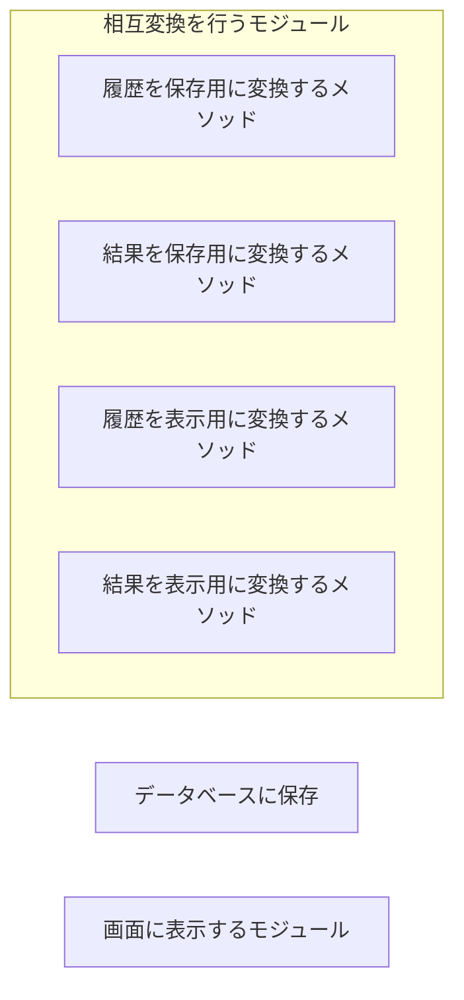

:::message alert
**記事の続編が出ました．** より包括的な内容となっているのでご確認ください．
[クリーンアーキわからんかった人のためのクリーンじゃないけどクリーンみたいなオニオンに見せかけたSOLIDの話](./no-clean_like-clean_its-onion-solid)
:::

# 依存関係逆転の原則に苦しんだ方々、いかがお過ごしでしょうか。
今回はアプリ設計の話です。
アプリ設計におけるクリーンアーキテクチャについて少し語り、調べていくうえで誤解していた部分や理解しにくかった部分を語ったうえで、オニオンアーキテクチャとクリーンアーキテクチャというよく似た二種類のアーキテクチャの説明をしていく、という流れとなっています。

:::message alert
かなり経験からの持論があるのでめちゃくちゃ有識者の方の意見聞きたい気持ちがすごいです。
:::

## 言葉の定義について

ここではアーキテクチャにおけるインターフェイスとプログラミング言語におけるインターフェイスを区別するために、プログラミング言語におけるインターフェイスを**抽象型**と表記します。

> それぞれの言語において、抽象型は以下のような言語機能で実現されています[^1]。
> - Java, C#などにおける抽象クラス `abstract class`
> - Java, C#, Golangなどにおけるインターフェイス `interface`
> - rustにおけるトレイト `trait`
> - Pythonにおける抽象基底クラス `abstract base class`
> - C++における純粋仮想関数 `pure virtual function`
:::message
言語によっては抽象クラスとインターフェイスが別々に用意されている場合がありますが、今回は区別しません。
:::

抽象型は同様のメソッドを持つオブジェクトの集まりという感じのイメージです。
それ単体では動作せず、抽象型に示された条件を満たすオブジェクト（構造体やクラスなど）を代入することで動作できる、という特徴を持っています。詳しくはググってください。

[^1]: 作るデータ構造や利用の仕方によっては必ずしも抽象型を使用しなくてもよい場合があります。例えば、C++20のコンセプトによるテンプレートパラメータの制約やC言語のヘッダ/ソースを用いた宣言と実装の分離でも解決できる場合があります。しかし、そういう事例を小分けにすると面倒なので全部一括りで抽象型と表記します。

## 参考にしたもののエトセトラ
基本的には自分の経験と、執筆時に改めて参考にした記事です。
- [クリーンアーキテクチャ完全に理解した](https://gist.github.com/mpppk/609d592f25cab9312654b39f1b357c60)
- [オニオンアーキテクチャとは何か](https://qiita.com/cocoa-maemae/items/e3f2eabbe0877c2af8d0)

# クリーンアーキテクチャとは
## その目的
はじめは、なぜクリーンアーキテクチャを使いたいのか、ということを考えます。大きく分けて以下の2個に分類されます。
- 各モジュールにおける関心事を限定する
- 依存関係をよりシンプルなものにする

一つ一つその意味を確認していきます。

### 各モジュールにおける関心事を限定する
大きなプログラムを作るとき、「データベースに接続するモジュール」「特定のビジネスルールを実行するモジュール」という風に大きな問題を小さな話題に分割し、他の要素を排除していく、という考え方をしていきます。
簡単な例（大規模であればあるほどクリーンアーキテクチャとしてのメリットが大きくなるので、あまりいい例ではない）を示します。

以上のようなモジュールがあったときに、表示方法を変更する場合、各モジュールで画面への表示方法を変えなければいけないわけです。しかも、その細部までの情報がないので「この関数内で変更すべき場所があるかどうか」ということがわかりにくくなります。

このように問題を細分化していくことで、変更などの対応に素早く対応することができ、関心事が一つに集約されるので後から読んでもわかりやすいプロダクトを作ることができます。
この例ではUIの例ですが、フレームワークやテスト、データベースなどの外界と実際のアプリケーションが分割されるようなプロダクトを作ることで、より効率的・置換可能で互いが疎な開発を行うことができるのです。

> 実際、クリーンアーキテクチャではユースケース層（ビジネスクロック）はインフラストラクチャ層に依存しないのでユースケース層は自分が出した結果が抽象型を用いて保存されていることを知っていても、それがデータベースへの保存なのか、テキストファイルへの保存なのか、あるいは保存されてすらいないのかは知ることはありませんし、責任を持つこともありません。

### 依存関係をよりシンプルなものにする

クリーンアーキテクチャを調べた方なら皆さんもこれは見たことあるでしょう。このグラフです。よく右下にあるグラフのほうが大事といわれます（実際に大事）が、今大事なのは左側の円と左側の矢印です。
これは狭義の意味になりますが、要するに、**外側から内側への一方向にのみ依存していく**ということです。外側のフレームワークやドライバーから、ビジネスクロックなどを含むユースケース層、データ構造などを含むエンティティ層と向かっていきます。**具体的なところから抽象的となる方向に向かって依存していく**とも言い換えられます、それだけです。「で？」という気持ちはわかります（実際にボクもなった）が、具体的な実装方法は説明します。

## 基本方針（ここまでのまとめ）
では、前述したような目的を達成していくための方針をここでまとめておきます。正直、上の話をまとめただけなのでここだけわかっていればどうにかなります。

- クリーンアーキテクチャは問題を細分化するための仕組みである。
    - 問題を細分化して他の要素を排除していくために用いる。
- デバイスからデータ構造へ、どんどん具体的な概念から抽象的な概念に向かって依存していく。

# クリーンアーキテクチャのわかりにくいところ
基本的に自分が躓いたところについて解説していきます。

## アーキテクチャのインターフェイスと言語機能のインターフェイスは違う
多分ボクが一番苦しんだところかもしれない笑
アーキテクチャのインターフェイスはユースケース層とインフラストラクチャ層を変換するエリアであり、**変換することに注目した関数や構造体などの独立したモジュール**です。あくまでも言語機能のインターフェイスではないことを意識しておいてください。
:::message
これらを区別する必要があるので、この記事では言語機能のインターフェイスの事を**抽象型**と呼ぶこととします。
:::

## 「フレームワーク」「ドライバ」は大抵ライブラリとして提供されている事実
インフラストラクチャ内に含まれているフレームワーク・ドライバというのは、SQLであればSQLの、GPUであればGPUのライブラリがそれぞれ世の中では提供されています。これを一から作るのはあほです。当然使用します。
しかし、使用しようとすると大きな問題が発生します。エントリポイント以外ではインフラストラクチャ層からインターフェイス層を呼び出す手立てがありません（エントリポイント自体がインターフェイスに属するという意見も聞くので一概に言えませんが）。これはつまり、**どうやってもインフラストラクチャ層はインターフェイス層を呼び出すことはできません**。インターフェイスからインフラストラクチャ層を呼ばなければいけないということです。このため、言葉ではクリーンアーキテクチャと言っても実際に厳格なクリーンアーキテクチャを実装しているケースは少ないです。
:::message alert
しかし、このような文句・苦情を想定してか、クリーンアーキテクチャにおけるインフラストラクチャ層には`Adapter`や`Translator`という形でより抽象的なところで使用する形に変換する場合があります。これがまた状況をごちゃごちゃにしていきます。
:::

# インフラストラクチャ層とインターフェイス層の違いって何ですか？
一応、定義をもう一度確認しておきます。
- インフラストラクチャ層はデバイスや実行環境のドライバやフレームワーク
- インターフェイス層はユースケース層とインフラストラクチャ層の相互変換を行う

しかし、フレームワークやドライバはすでに既存のものを使うことが大半です。また、クリーンアーキテクチャにおいてインフラストラクチャ層の変更（特に使用する外部環境の交換）はそれにインターフェイス層「ユースケース層で使用するデータ型に変更」をインフラストラクチャ層に合わせて変更することでユースケース層には影響が出ないように解決します。
つまり、インフラストラクチャ層の変更とインターフェイス層の変更はおよそリンクしているのです。

# オニオンアーキテクチャの提案

ここで、ボクはオニオンアーキテクチャを提案します。**やっていることそれ自体はあまり変わりません**。大事なことなので二度言います。**やっていることそれ自体はクリーンアーキテクチャと大差ありません**。

## 実際の実装方法
ドメインモデル層、ドメインサービス層、アプリケーションサービス層、インフラストラクチャ層の4層に分割して、以下の方針で実装します。
- **ドメインモデル層**はデータ構造に焦点を当てて実装します
- **ドメインサービス層**は実装する必要はありませんが、**インフラストラクチャ層やアプリケーションサービス層で実装するべき機能を抽象型でまとめておきます**。この抽象型はアプリケーションサービス層がインフラストラクチャ層を呼ぶときに使用し、引数にはドメインモデル層で使用しているデータ型やそのメンバー型であるべきです。
- **アプリケーションサービス層**はそれぞれ**ビジネスクロックを定義すること**に焦点を当てて実装します。ドメインモデル層のデータ構造を使い、ドメインサービス層で定義された抽象型からインフラストラクチャ層のモジュールや他のアプリケーションサービスのモジュールを扱います。
- **インフラストラクチャ層**では、**ドライバやフレームワークを利用し、ユースケース層で使用するデータ構造に変換**、またはその逆である**ユースケース層からのデータをドライバやフレームワークで利用するための変換**に焦点を当てて実装します。この時、ドメインサービス層で定義した抽象型に沿うように設計します。
    - このとき、エントリポイントはインフラストラクチャ層に配置し、インフラストラクチャ層の初期化を行ってからアプリケーションサービス層に自身を含むインフラストラクチャ層のモジュールをドメインサービス層で定義した抽象型として渡します。

ドライバやフレームワークの変更を行ったとしてもユースケース層の抽象型を満たすインフラストラクチャ層のモジュールを作ることをユースケース層は変えずに済むことができます。

## クリーンアーキテクチャとの違い
本質的な違いはありません。命名とその説明方法の差異が一番大きいと思っています。ただし、この認識は特にボクの主観が入っているところがあり、あくまで「こう考えるとわかりやすいよ」くらいだと思って眺めていてください。

| クリーンアーキテクチャのおける概念 | オニオンアーキテクチャにおける概念 |
| :-: | :-: |
| エンティティ層 | ドメインモデル層 |
| （エンティティまたはユースケース層） | ドメインサービス層 |
| ユースケース層 | アプリケーションサービス層 |
| インターフェイス層 | インフラストラクチャ層 |
| インフラストラクチャ層 | （外界扱い） |

# おわりに
いかがだったでしょうか。多分言いたいことは全部言った気がします。クリーンアーキテクチャの考え方で実装しにくいと思ったら、一度オニオンアーキテクチャで実装してみるのが良いと思います。

## 最後に宣伝
「適度にもくもく、適度に駄弁る。」をテーマにした作業部屋「適度に駄弁る作業部屋」の参加者を募集しています。
このサーバーは私が自作した運営ボットによって参加者のミュートを管理し，一定時間で休憩用の部屋に分けてその場に居合わせた人たちとのんびり話すことができるサーバーです．一人でもボットがボイスチャットで応援してくれます．
老若男女問わず歓迎しているのでぜひぜひ。（ボクが集めると学生ばかりになってしまうので社会人の方ぜひきてください＞＜）

