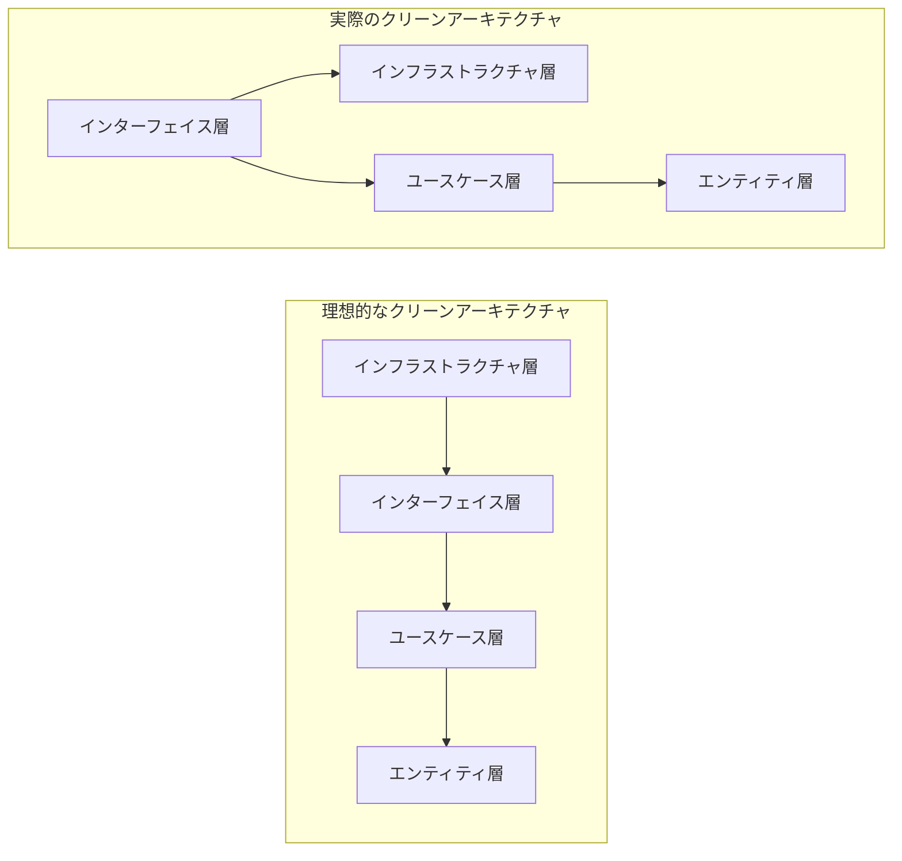

いつか投稿しようとは思っていたのですが，ちょうど無職やめ太郎さんの「ググって解決しづらかったこと Advent Calendar」という，いかにもこの話題にピッタリなAdvent Calendarがあったので締め切りを設ける目的も兼ねて参加してみることにしました．

後から気づいたのですがQiita主催のアドベントカレンダーなんですね．

https://qiita.com/advent-calendar/2021/gseach

# 依存関係逆転則含む諸原則に苦しめられた方々，いかがお過ごしでしょうか．

今回はアプリ設計の話です．と言っても，前回「クリーンアーキわからんかった人のためのオニオンアーキテクチャ」というZenn記事を書いて，反響が大きかったのでリメイクしたいなという気持ちになり執筆することにしました．

前回同様，調べていく上で誤解していた部分や理解しにくかった部分を語った上で，オニオンアーキテクチャという，クリーンじゃないけどクリーンみたいな玉ねぎについて紹介するのですが，今回はわかりやすい図解であったり，実際にどのような実装をしていくべきなのかを話の話題として加えていければ良いかな？って思っています．

:::message
前回の記事を知らない方でも内容がわかる記事となっているので安心してお読みください．
:::

これは前回の記事である「クリーンアーキわからんかった人のためのオニオンアーキテクチャ」の記事の裏話的な話を一つさせてください．

今年の11月初め頃に，サポーターズという企業の学生が登壇できるLT会があり，私は登壇者として話すことになりました．そこで私は「クリーンアーキテクチャよりもオニオンアーキテクチャの方がわかりやすいやんけ」という具合に宣伝して回る予定だったのですが，その当時の私は経験的にオニオンアーキテクチャの概念を知っていたに過ぎないのでどの言葉がどの概念に対応するのかがわかっておらず，調べるきっかけとして執筆した，という経緯があります．

今回は，逆にLT会で使用したスライドをベースにしよう！というモチベーションで書いていきたいと思います．

@[speakerdeck](ce870141ec5d401c9eed87937fd5dcfb)

## アーキテクチャを知ったら飯が食えるのか

アーキテクチャの有用性の話ですね．多くの方がそれぞれの意見を語っているので私も私の意見を言うのですが，アーキテクチャを知ることで仕事が楽になると考えています．

設計指針を抱くことができる，と言う観点でみると，アーキテクチャは「何をどこに実装するべきなのか」と言うことが方針として決めることができます．
また，それぞれのアーキテクチャの特徴や利点を知ることで保守性の向上にもつなげることができます．

# あのドーナツに騙されてはいけない

さて，ここから本題に入っていきたいと思います．

最初に話す話題はズバリ「クリーンアーキテクチャとはなんなのか？」です．もし，皆様がクリーンアーキテクチャについて調べたことのある方ならばまずこの画像を目にしたことがあるのではないでしょうか．


この図について簡単に解説すると，一個のプロダクトに対して，一番外側にある **「Frameworks & Drivers（Infrastructure）」** 層から **「Interface」** 層， **「Use Cases」** 層， **「Entities」** 層という四層がそれぞれにモジュールを持っており，外側から内側に向かって依存していく，ということを示した図です．

よく，この図がクリーンアーキテクチャを解説する記事に載っていることが多いし，この記事でも今こうやって使ってはいるのですが，勘違いしないでほしいことは **「必ずしも四層であるとは限らない」** ということです．換言すれば，クリーンアーキテクチャが前述した四層で構成されているとは限らないという意味です．

多くの記事ではこの四層で解説していることが多いのですが，汎用化することが難しいという結論に至っています．
そこでこの記事では，クリーンアーキテクチャの定義について「SOLID原則をよく満たした設計である」，という考え方を採用します．

:::message
クリーンという傲慢な名前をつけている割に四層しか認めないという世間の姿勢に反抗したい気持ちもあったりします．
:::

## クリーンアーキテクチャのSOLID原則
前述した通り，この記事ではクリーンアーキテクチャの定義として「SOLID原則をよく満たした設計である」，という考え方を採用するのですが，そもそもSOLID原則とはなんぞや？という話をします．
おそらく，この話をちゃんと触れないとクリーンアーキテクチャは説明しにくいのですが，説明しようとすると上の四層構造と同時に話すことでごっちゃになってしまうので別々に語られることが多いように感じています．

1. **単一責任の原則** `Single Responsibility Principle, SRP` 
    考え方としてはそこまで難しくはなく， **「一つのモジュールの中で焦点を当てるべきは一つだけ」** という考え方です．
    例えば，データベースを操作するモジュールがあれば，それ以外の概念は加えない，という考え方です．逆に，この原則には裏があり， **「一つの問題に焦点を当てるモジュールは一つだけ」** という考え方もできます．
1. **開放閉鎖の原則** `Open Closed Princple, OCP`
    考え方としては， **「よく更新されるモジュールに依存したくないので，改変されないモジュールに依存しよう」** という考え方です．
    フロントエンドやインフラなど（特に前者）は外的要因もあり更新することが多いですが，それに依存するユースケース層はその更新毎に更新しなければいけなくなるので大変非効率なのでやめましょう，という考え方です．
1. **リスコフの置換原則** `Liscov Substitution Principle, LSP`
    考え方としては，**「もしモジュールを交換する必要があれば，他のモジュールは更新せずに済むような仕組みを作ろう」** という考え方です．
    前述した通り，外的要因を受けるフロントエンドやインフラを更新では間に合わず交換が必要だと判断されたときに他のモジュールも変える必要があるようでは意味がないのでその仕組みづくりについて言及しています．
1. **インターフェイス分離の原則** `Interface Segmentation Principle, ISP`
    インターフェイス分離などと言っていますが，考え方としてはもっと抽象的で，**「不要なモジュールには依存しない」**　という考え方を取ります．
    理由は色々あるのですが，そのモジュール内で扱うべき問題を小さくするという側面が一番強いように思います．触らぬ神に祟りなしとも言いますし，きっとそういうことです．
1. **依存関係逆転の原則** `Dependency Inversion Principle, DIP`
    聞いたことがある方も多いのではないでしょうか，これは方針というよりも方法論という側面の方が強いのですが，考え方としては **「具体的なモジュールが抽象的なモジュールに依存する」** という考え方です．
    私もついこの間まで方法論だと思っていたのですが，あくまでも指針だと言い張っているのできっと指針なのでしょう．


SOLID原則については，上の解説と若干違いますが（私自身どっちが正しいかわからん）こちらの記事が伝統的なレイヤードアーキテクチャとクリーンアーキテクチャを比較しながらSOLID原則をわかりやすく解説しているのでお薦めしておきます．

https://www.12-technology.com/2021/06/blog-post.html

また，この記事もそれぞれの意味を端的に示していてわかりやすかったのでお薦めしておきます．

https://kyonc5.hatenablog.com/entry/2021/07/11/100923

## 方法論としてのクリーンアーキテクチャ

さて，SOLID原則は前述した5個の原則の頭文字をとったもので，これらの達成のためにクリーンアーキテクチャがありますよ，という考え方をこの記事では採用します．

SOLID原則を満たすことで，個々の分けられたモジュールはそれぞれが個別に更新可能となり，外的影響を受けてモジュールの変更を余儀なくされても変更箇所を小さくまとめることができるつよつよプロダクトとなるのですが，次はその方法論の話です．
実は，方法論としてのクリーンアーキテクチャで下の画像を使うと混乱します．
:::message
誤解を防ぐために，ここから先は厳密に **上記の各層のことを「〜〜層」と呼ぶことにします．**．
:::


先ほども出てきました，クリーンアーキテクチャの図です．

さて，クリーンアーキテクチャを実装していく上で大事な概念となってくるのがインターフェイスです．これは **上の画像の層ではなく，プログラミング言語における概念** であることに注意してください．rustであればトレイトと呼ばれる概念のことです．

結論から言うと，インターフェイスが抽象度の高いモジュールとして君臨し，それぞれ実装が記述された各モジュールは， **満たすべきインターフェイスの要件を満たしつつ，目的を達成するために必要な他のモジュールをインターフェイス経由で参照する** ことで5つあるSOLID原則のうち，L, Dを達成することができます．

**リスコフの置換原則** `Liscov Substitution Principle, LSP`
> モジュールを交換する必要があるならば，他のモジュールは更新せずに済むような仕組みを作ろう

と言う方針でした．これは， **インターフェイスを各モジュールの間に挟む** ことで解決します．これは具体例を見た方がいいでしょう．下のコードはGo言語標準ライブラリの `io.Writer` インターフェイスの定義です．
```go
type Writer interface {
    Write(p []byte) (n int, err error)
}
```
これの意味するところは「バイナリ`p`を書き込み，書き込んだバイト数を戻り値として返す」と言うことなのですが，書き込む先や用途については言及されていません．実際，それぞれこれを満たす様々な実装が考えられ，実際に標準ライブラリだけ見てみても以下のような実装が用意されています．

- `os.StdOut`: 標準出力への書き込み
- `os.(*File)`: ファイルへの書き込み
- `net.(*TCPConn)`: TCP通信を用いたデータ送信
- `os/exec.(*Cmd).StdinPipe()`: 実行中な別プログラムの標準入力への書き込み
- `bytes.(*Buffer)`: メモリバッファへの書き込み
- `compress/flate.(*Writer)`: データの圧縮

少し大袈裟がかもしれませんが，いずれも「バイナリを書き込む」と言う目的を持っていることでは一致しており， `io.Writer` を経由して作業する場合には置換可能であるといえます．原則の定義に戻りますが，これらは利用用途が変化や拡大した場合，実装が大きく変化した場合にも最小限の変更に抑えるのに非常に有用なのです．

**依存関係逆転の原則** `Dependency Inversion Principle, DIP`
> 具体的なモジュールが抽象的なモジュールに依存しよう

と言う方針でした．これは　**「実装モジュールがインターフェイスを参照する」** ことを意味します．実際，抽象的な概念であるインターフェイスを実装モジュールで使用することは上記の意味そのままだといえます．
インターフェイスに合わせてモジュールを作ることはリスコフの置換原則だけみても，大変有効な手段と言えます．しかし，実装のモジュールがインターフェイスを使わなければその意味がなくなってしまうのです．

そこで，この原則では，実装モジュールがインターフェイスを参照すると言うことを明文化しているのです．
:::message
世の中の記事を見ていると，これが一人歩きしているケースが多い気がします．
持論ではあるのですが，それは，この原則がインターフェイスの使い方を具体的に示していて一番わかりやすいだからと考えています．
:::

さて，ここまでインターフェイスの使い方について話してきましたが，実際にどのような配置を考えていけば良いのかは残りの三原則が示しています．

**単一責任の原則** `Single Responsibility Principle, SRP` 
> 一つのモジュールの中で焦点を当てるべきは一つだけ

と言う方針でした．書いてあることそのままです．一つのモジュールで焦点を当てるべきは一個だけと言うことです．これはインターフェイスにも適用することができます．
リスコフの置換原則で示した `io.Writer` はインターフェイスの中に関数が一個しかない極端な例ですが，小さいと抽象度が上がる傾向にあるので型の管理やコーディングの苦にならなければアリな気もします．
:::message
`io.Writer` は多くのユーザーが使用する標準ライブラリという側面もあるので極端な抽象化をおこなっているのかもしれません．また， `io.WriteCloser`, `io.ReadWriter` など，複合したインターフェイスもあるので，それぞれの用途の範囲で使い分けてください．
:::

**開放閉鎖の原則** `Open Closed Princple, OCP`
> よく更新されるモジュールに依存したくないので，改変されないモジュールに依存しよう

という方針でした．ここで初めて，あの画像が出てきます．

フロントエンドやデータベース，デバイスなどの周囲の環境に依存するプロダクトでは問題なので，これらを管理するモジュールを含むインフラストラクチャ層を外部に置き，内部のビジネスロジックを含むユースケース層，さらに静的な概念であるデータ構造を含むエンティティ層などの，より大きな変更が発生しにくいモジュールを依存していく方向に依存していくのです．

:::message alert
ここでインターフェイス層の話を外したのは故意です．
理由はいくつかあるのですが，今まで話してきた言語機能のインターフェイスと混同してほしくないという問題と，そもそもインターフェイス層の定義が曖昧になりがちなのがこの層なのであまり触れたくない気持ちです．
:::

**インターフェイス分離の原則** `Interface Segmentation Principle, ISP`
> 不要なモジュールには依存しない

という方針です．多くのかたが例としてあげているのはインフラストラクチャ層にありがちな，画面に表示するためのモジュールと入力として入力値として受け取るためのモジュールでしょうか．これらはデバイスに関することで同時に定義されることもしばしばありますし，私も実際にそういうことは行うのですが，それを全て上位のモジュールに渡すのはナンセンスです．
そこで，インターフェイスで表示に着目したモジュールと入力に着目したモジュールを作成することで解決します．

具体的に見てみると，以下のようなモジュールを作ったとします．
```go
type Device struct {
    on func()
}
func (d *Device) SetCallback(on func()) { d.on = on }
func (d *Device) Print(str string) { /* ... */ }
```

この `Device` 構造体にはコールバックを設定する関数と，文字列を表示する関数が含まれているのですが，これをインターフェイスを使って以下のように分けます（命名雑スギィ）．
```go
type SetCB interface {
    SetCallback(onFunc func())
}
type OutStr interface {
    Print(str string)
}
```
これらのインターフェイスはそれぞれ，コールバックを設定することに着目したインターフェイスと，文字列を出力することに着目したインターフェイスです．これらは `Device` 構造体はこれらのインターフェイスをそれぞれ満たすことができます．これらのインターフェイスを介して参照することで，入力と出力それぞれに焦点を絞ったモジュールとして利用することができます．

## とどのつまり？
ここまでの内容をまとめていきたいと思います．
この記事において，クリーンアーキテクチャは **「SOLID原則をよく満たした設計」** と見なすことで解決し，そのために以下のようなことを気をつけて実装します．大事なことなので，全部太字ですね．

---

- **実装が記述されたモジュールとは別に，モジュールが満たすべき要件を記述したインターフェイスを用意し，インターフェイスに合わせた実装モジュールを用意する．また，実装モジュールはインターフェイスに依存する．（リスコフの置換原則，依存関係逆転の原則）**
- **一つのモジュールが担当する課題は一つに限定する．また，別の側面から見て複数の課題が含まれているときはインターフェイスを用いて着目すべき問題に限定する．（単一責任の原則，インターフェイス分離の原則）**
- **更新・変更が頻繁に行われるだろうモジュールは，より更新頻度の小さいモジュールに依存する．（開放閉鎖の原則）**

---

# クリーンアーキテクチャはわかりにくい

さて，ここまでクリーンアーキテクチャの定義（概念）について話してきましたが，次は実用の話をしましょう．

一般に，アーキテクチャは抽象的な概念であるために理解が難しいとされる傾向がありますが，その中でもクリーンアーキテクチャは調べてわかるような代物ではないと私は考えています．


1. 名前の混同
    クリーンアーキテクチャとして示される四層の中でボクが一番嫌いなインターフェイス層の話です．インターフェイス層でインターフェイスを定義しなければいけない，なんて制約はなく，むしろ **インターフェイスはもっと上位のエンティティ層やユースケース層で定義されます**．
    対して，インターフェイス層では「インフラストラクチャ層からのアプローチがあったときにどのようなビジネスクロックを実行するか」を定義する仲介のような役割を担うモジュールを含めます．
2. 抽象的概念
    ただでさえアーキテクチャが抽象的な概念なのですが，その上で方針だけを示す上記のようなクリーンアーキテクチャが口頭で話される例をいくつか知っています．
    その一方でこういう技術記事で話されるクリーンアーキテクチャの多くは四層の役割を厳密に指定したある意味定義通りのクリーンアーキテクチャです．
    :::message
    このある意味定義通りのクリーンアーキテクチャのことを **厳密なクリーンアーキテクチャ** と呼ぶことにしましょう．
    :::
    どちらが正しいのかわからなくなってしまいますし，特に抽象的な口頭で話される定義を採用しようものなら誰も理解できなくなってしまいます．
3. 説明不足
    この記事で定義するクリーンアーキテクチャの方が抽象的ですが，厳密なクリーンアーキテクチャも十分抽象的です．
    それゆえに，インターフェイスを定義すべき層やインフラストラクチャ層で定義すべきこと，インターフェイス層の存在意義など，どれも重要な概念ではあるのですが多くの記事で説明がなされなかったり，欠けていたりします．
4. 実現性の薄さ
    抽象的概念で示したように，しばしば口頭で話されるクリーンアーキテクチャと技術記事で話されるクリーンアーキテクチャには乖離があります．
    また，多くの記事で説明不足となりがちです．
    これらの理由に，実際に後者の厳密なクリーンアーキテクチャを遵守しようと思うと，難しいのです．
    例えば，インフラストラクチャ層は `Frameworks & Drivers` と定義されていますが，実際に利用しようと思うと大体ライブラリとして提供されていることが多いので， **どう考えてもインフラストラクチャ層が自前のユースケース層やインターフェイス層に依存することなんて無理** です．
    ライブラリとユースケース層やエンティティ層を紐づけるのはインターフェイス層の仕事なんです．


クリーンアーキテクチャを理解する障壁にはこれだけの理由があるのです．

# オニオンアーキテクチャを知る
結論は至ってシンプルです．
この記事におけるクリーンアーキテクチャについて知るにはオニオンアーキテクチャを知ることが一番手っ取り早いです．これに関しては，スライドの説明が一番わかりやすいのでそれを使います．


## Infrastructure層
まず一番左側のInfrastructure層では，ライブラリやドライバを使った処理やデバイスなどに関わる処理と上位層のモジュールを紐づけるためのモジュールをこの層で定義します．厳密なクリーンアーキテクチャでいうところのインターフェイス層によく似ています．

## Appllication Services層
隣にあるApplication Services層では，ビジネスクロックに関わる処理を定義します．厳密なクリーンアーキテクチャでいうところのユースケース層と同じです（差異はありません）．

## Domain Services層
**ここが画期的です．** 
Domain Services層では，インターフェイスを定義します．ここで定義するインターフェイスの実装はApplication Services層で定義しても，Infrastructure層で定義しても，それぞれの用途に応じて変えられるのですが，この層で定義するインターフェイスを用いて下位層にあるモジュールは他のモジュールを参照することが理想的です．

## Domain Model層
最後に一番左側のDomain Model層では，データ構造などに関わるモジュールを定義します．この層は最上位層で頻繁に変えるべきではなく，そのためにどこにも依存しないことがミソです．
厳密なクリーンアーキテクチャでいうところのエンティティ層と同じです．


# 終わりに
さて，前回と比較してもわかりやすい記事となったと思っています．そもそもソフトウェア設計それ自体が勉強しにくいものであるので，わかりやすく解説された記事も見つけにくいのかな〜と思いながら今回の記事を書きました．
当初想定していたよりもより抽象的な概念での解説となってしまいましたが，抽象的な概念から具体的な実装まで解説したつもりです（これ以上具体性を増やすなら記事としてではなく本を書いた方がいいかもしれない）．

最後になりましたが，これらの知識は実に抽象的ですが，それゆえに応用が効く素晴らしい技術です．特定の言語や技術に縛られることもなく，アルゴリズムや機械学習のようにライブラリ化できるわけでもない，そういう技術だと私は思っています．
この機にあなたも始めてみてはいかがでしょうか．

「適度にもくもく、適度に駄弁る。」をテーマにした作業部屋「適度に駄弁る作業部屋」の参加者を募集しています。
このサーバーは私が自作した運営ボットによって参加者のミュートを管理し，一定時間で休憩用の部屋に分けてその場に居合わせた人たちとのんびり話すことができるサーバーです．一人でもボットがボイスチャットで応援してくれます．
老若男女問わず歓迎しているのでぜひぜひ。（ボクが集めると学生ばかりになってしまうので社会人の方ぜひきてください＞＜）

[](https://discord.gg/pcR7uwYxe9)
