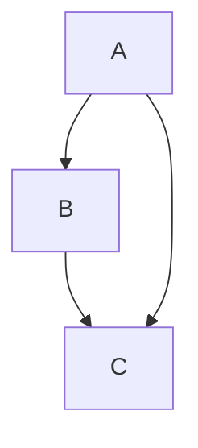
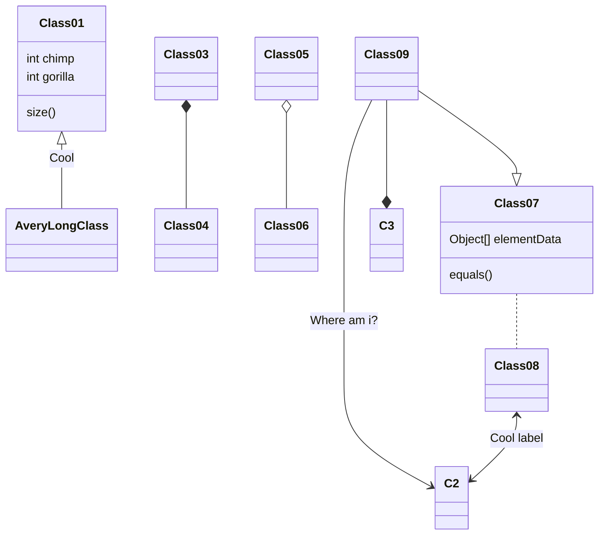

# VS Coderならびにバックエンダーマンの皆様、いかがお過ごしでしょうか。
今回はVS Codeで絵を描いていきたいと思います。一応、この記事のターゲット層は「VS Codeを使用している、はたらく大人」くらいのかなり多くの人を対象にしましたが、**制作期間一週間や二週間程度の小規模単発開発でもない限りどのような場所でも使える技**だと思います。ぜひ最後ままで読んで感想をいただけたらと思います。

## なぜVS Codeでグラフを書くのか
それに伴って、「なぜVS Codeでグラフを書くのか」、という話題を先に確認します。結論から言うと、理由は以下の通りです。

- **データの関係を簡単に可視化できる**
- **目指すべき目標や逆にやってはいけないことを共有できる**
- **Gitでソースコードと一緒に管理することでバージョン管理が行える**
- **そのうえで、VS Codeだけでグラフを書くことができて、その閲覧もVS Code内で完結させることができる**

とくに、可視化することで目指すべき像がわかるだけでなくそれを共有することができるというメリットは大きいです。「ソースコードにコメントを書く」、という行為もリーダブルなコードを書くという意味ではとても大事ですが、それとは意味が違います。事前に関係図を示すことで指針を示すことができ、協力者とのコミュニケーションを円滑にすることができるのです。
:::message
このメリットは、大規模長期間の開発やクリーンアーキテクチャを使用した複雑なモジュール構造を持つアプリケーションを開発するとき、あるいは開発人数が多くなればなるほど顕著になるでしょう。
:::
この強力なメリットを**Gitでバージョン管理された共通のファイルを参照する**、**VS Codeという「ソースコードを書く唯一にして共通のツール」で全員が閲覧し**、このことこそがわざわざ「VS Codeで絵を描く」ということの最大のメリットなのです。

:::message alert
**このメリットを理解したうえで、以降の記事を読みましょう。**
:::

# Draw.io Integration [導入ボタン](vscode:extension/hediet.vscode-drawio)
Draw.ioはオンライン上で使える無料のグラフツールとして割と有名だと思います。グラフツールを探したことのある方なら一度はオンライン上のものを使ってみた事があるのではないでしょうか。
この拡張機能はVS Code上でDraw.ioを実行します。
このグラフツールはオブジェクトをドラッグで移動させることができるので、綺麗なグラフ、とくにフローチャートを書くことに向いています。

これを事前にテストしたい方は、前述したオンライン上のものを使用することをオススメします。

https://draw.io

## しかし、ボク個人としてはこの拡張機能をオススメしません。
理由はいくつかあります。

- **そもそもマウスを使う時点でVimあがりが嫌う（偏見[^1]）。** また、描画が後述する2個の拡張機能に比べて重い。
- オブジェクトの位置を動かすだけでファイルの変更が付くので各変更で名前を付けなければいけないGitでのバージョン管理に向いていない。
- 自動的な位置調整機能がないので機能付加時に変更が難しくなり、見にくいグラフができあがる。

[^1]: Visual Studioあがりのボクでも面倒だと思うので、Vimあがりなら親の仇だと言わんばかりに嫌うに違いないきっとそう。

これらの理由は、**チームで共通のファイルを参照し、共有する**、という目的の達成の邪魔をします。
:::message
ただ、前述したように整ったグラフを書くのにとても適しているのでそういうニーズがあった場合に使用してみるのはかなりアリだと思います。
:::

# Markdown Preview Mermaid Support [導入ボタン](vscode:extension/bierner.markdown-mermaid)

いろんなタイプのグラフをマークダウン上に書き、それを上の図のような感じでプレビューする拡張機能です（Zennの記事に埋め込めるくらいには有名らしい、知らんけど）。mermaidについては[公式ページ](http://mermaid-js.github.io/mermaid/#/)が例文と図が一緒に示されていて一番わかりやすかったのでそれを参照してみてください。

これはMarkdownを使用して編集します。ちゃんと使い分けないと描画結果が滅茶苦茶横長になったりしますが、そこさえ気を付ければ一番汎用性と機能のバランスがとれていて、できることもそれなりに多いので一番オススメです。

:::message
後述するPlantUMLもですがテキストベースで編集できます。オブジェクトのグラフ上の配置を一切考えなくてもいい代わりに、オブジェクトの位置や矢印が不自然な曲がり方をすることも欠点のひとつと言えるかもしれません。
:::

# PlantUML [導入ボタン](vscode:extension/jebbs.plantuml)
PlantUMLはUML図（Unified Modeling Language: 統一モデリング言語）を記述するために特化したPlantUMLを使用します。
統一モデリング言語の文法に関してはこの人の記事がわかりやすかったのでこちらを参照してください。

https://qiita.com/kyonc5/items/4d536cb59fd7c41debc1

この拡張機能は、`*.puml` などの拡張子を持つファイルに対して機能します。
規模や粒度によっては書くことが面倒ですが、その代わりに多くの場所で用いられていることもあって、色々な生成ツールが出回っているという印象です（そこまでは調べる気になれませんでしたごめんなさい）。
また、2個目に紹介したmermaid supportよりもモジュールなどの詳細な情報を書き込めるので、より大規模な開発になるとこちらの方がよいです。
:::message
[公式ページ](https://plantuml.com/ja/)ではオンライン上で動かすジェネレーターもあるのでそちらを一度参照することをオススメします。
:::

いかがだったでしょうか。全体像をVS Codeを用いながら共通認識を全体で持つ事によって、開発速度をあげることができると思ったので記事にしました。
正直な話、それぞれ一長一短なところは調べている最中ボクはかなり感じたのですが、それをVS Codeという単一のツールの中で使い分けることが一番大事だと思っています。

https://twitter.com/StreamWest1629/status/1428500472172728321?s=20

# 最後に自己紹介
大学生してます。Go言語を用いたプロダクト「rehearsal」を片手に持って技育展2021に出展します。今欲しいものは応援とTwitterのフォロワーです。

@[card](https://twitter.com/streamwest1629)
